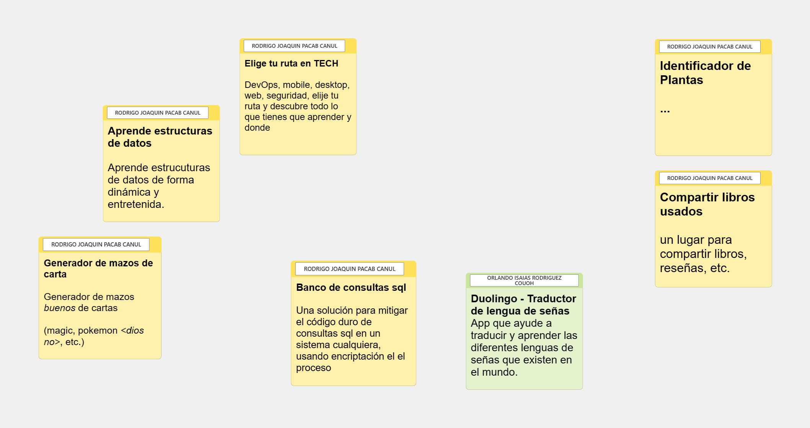

# Initial ideas

> September 13th, 2023

- [Initial ideas](#initial-ideas)
  - [Deck cards generator](#deck-cards-generator)
  - [Duolingo - Sign language translator](#duolingo---sign-language-translator)
  - [Sharing books](#sharing-books)
  - [Plant identifier](#plant-identifier)
  - [Learn data structures](#learn-data-structures)
  - [SQL bank](#sql-bank)
  - [Choose your learning path in TI](#choose-your-learning-path-in-ti)

Once the team was created, by our leader [**Isaías Rodríguez**](https://github.com/IsaiasRdzc), and integrated by team members:

- [Marco Canché](https://github.com/MarcoSIIIU)
- [Rodrigo Pacab](https://github.com/iKinoo)
- [José Luis Gutiérrez](https://github.com/Josegutierrezcouoh)
- [Carlos Israel Ruz](https://github.com/XxCharlyRuzxX)

The first step as a team was to do a brainstorm, so to do that we used Microsoft Whiteboard to make it more interactive so ideas could blow up and get reflected in the whiteboard.

In this phase, all counts, even the more ridiculous idea or topic, or even ideas from ChatGPT *(🤓)*

So, the ideas were these

> In English, from left to right and from down to up:  
> - **Deck cards generator** *(Generador de mazos de carta)*
> - **Learn data structures** *(Aprende estructuras de datos)*
> - **Choose your learning path in TI** *(Elige tu ruta en TECH)*
> - **SQL bank** *(Banco de consultas SQL)*
> - **Plants identifier** *(Identificador de plantas)*
> - **Duolingo - Sign language translator** *(Duolingo - Traductor de Lengua de señas)*
> - **Sharing books** *(Compartir libros)*

## Deck cards generator

It begins as a desperate way to get ideas for our project. There is a tiny group of people in FMAT that share the same hobby: cards, not conventional cards but friki cards:

Pokemon, Yu-Gi-Oh!, Magic, etc.

The relevant? words from a member of this group: "It would be interesting if a system that creates *good* deck cards", what does mean "good" in this context? these types of cards are more complex than conventional ones because there are so many parameters that determine if a deck card is or not *good*, though *good* still beings an ambiguous word.

## Duolingo - Sign language translator

The idea is good, but there are a lot of solutions already, the interesting would be to see at least one area that lets us innovate in a different way in that problem... and yeah, *Duolingo* is just for communication terms.

## Sharing books

This is another that just came up with the brainstorm, already exits the library, lecture zone, book store, and other alternatives, so this idea falls short.

## Plant identifier

Maybe we cannot see more than just a plant identifier, but this just came up with the brainstorm, as we said, in this phase, all ideas count.

## Learn data structures

It was inspired by the way that some people learn programming, for example, to learn animations with JavaScript you can create an interactive web page that shows you how linked lists work.

> **Aprendiendo Javascript**  
> Antonio Sarosi  
> https://youtu.be/ZnoMdsn13Mk

But taking away the programming part, is also a good way to learn data structures, so why not a similar mechanism to learn data structures? well, that's the base of the idea.

## SQL bank

There is a problem with software code: **hard code**, data that is explicitly *incrusted* in the code, and if you want to make changes, for example in a table that shows data, you have to change the SQL sentence and even worse if you work with code that needs to be compiled, and even if you have to redistribute the new version of the software? maybe we can't solve the distribution issue, but the hard code yes, at least with SQL sentences, what about a library that lets you change every SQL sentence that you need with an encrypted file, and you just need to change that file and not directly the code?

## Choose your learning path in TI

We think this is our best idea with the most potential because it wouldn't be just for this project but for the rest of our professional lives, because there are so many roles in the IT industry that for very young people like us who even just realizing what career we just joined, don't know what to do with their lives, the first step was to realize what being a Software Engineer means, the second step is what learning path to choose.

So why not *something* that lets you decide what role to choose, that shows you all that you have you learn, and **where**, and gives you evaluations of those places?

