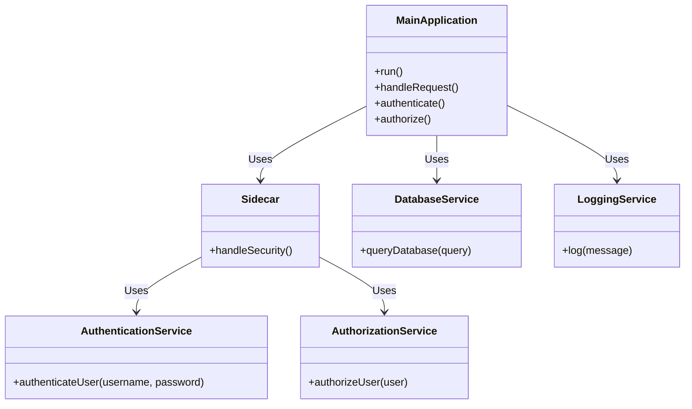

The Sidecar pattern is a design pattern in which a main application (or "_loader_") is paired with another smaller, specific-purpose application, called a "_Sidecar_". The Sidecar extends and enhances the capabilities of the main application without affecting its core logic. This modular approach allows you to add functionality without directly modifying the source code of the main application.

Sidecar Pattern Key Features:

**Decoupling:**

The main application and Sidecar run as separate processes, allowing for effective decoupling. The main application does not need to know the internal details of the Sidecar, and vice versa.

**Extensibility:**

Sidecar provides additional functionalities, such as monitoring, logging, encryption, proxy, among others. This improves the extensibility of the main application without modifying its source code.

**Reuse:**N

The Sidecar can be reused in different contexts with different main applications. While the Sidecar takes care of specific tasks, the main application can focus on its core logic.

**Scalability:**

The main application and Sidecar can be scaled out separately, making it easier to manage resources and adapt to changes in workload.

**Facilitates the Implementation of Patterns:**

The Sidecar pattern supports the implementation of various patterns such as reverse proxy, dependency injection, and others, without directly modifying the main application logic.

## Structure

---



- MainApplication is the main application that performs general operations.
- Sidecar is the Sidecar component that handles security tasks such as authentication and authorization.
- DatabaseService is an external service that the main application can use to query a database.
- LoggingService is an external service that the main application can use to log events or messages.

The main application uses the Sidecar pattern to handle security tasks. This Sidecar has two associated
services: AuthenticationService to authenticate users and AuthorizationService to authorize actions.

Additionally, the main application uses external services (DatabaseService and LoggingService) that are independent of the Sidecar pattern.

> This is just a conceptual example. In a real environment, the design and interaction between classes can be more complex and specific to the application you are building. This diagram represents a general structure in which the main application uses a Sidecar to handle security tasks and uses external services for additional functions.

If you want to learn more about this software design pattern visit: [_Sidecar pattern_](https://learn.microsoft.com/es-es/azure/architecture/patterns/sidecar)

## Real application example

---

[](https://postimg.cc/py246Zsr)

Kubernetes (K8s) is an open source platform designed for automating, deploying, scaling, and operating containerized applications. It was developed by Google and later donated to the Cloud Native Computing Foundation (CNCF).
Yes, I know Kubernetes. Kubernetes, often abbreviated as K8s, is an open source platform designed for automating, deploying, scaling, and operating containerized applications. It was developed by Google and later donated to the Cloud Native Computing Foundation (CNCF).

Some key features of Kubernetes include:

_Container Orchestration_: Kubernetes provides tools to efficiently deploy and manage application containers. Containers allow you to package an application and all its dependencies into a single, portable unit.

_Scalability_: Allows applications to be scaled up or down based on user demand. It also facilitates automatic scaling with dynamic creation or deletion of container instances as needed.

_Declarative Deployment_: Applications are described in YAML or JSON configuration files, allowing declarative deployment and management of the desired state of applications.

_Self-Healing_: Kubernetes constantly monitors the state of applications and automatically corrects any deviation from the desired state defined in the configuration.

_Service Discovery and Load Balancing_: Provides network services to allow containers to communicate with each other and provides load balancing to distribute traffic between containers.

### How is _Sidecar Pattern_ implemented in Kubernetes?

---

The Sidecar design pattern in Kubernetes is used to extend and enhance the capabilities of a main application by attaching an additional container (the "Sidecar") to the same pod as the main application. This Sidecar can provide additional functionality, such as security, logging, monitoring, or any specific task, without affecting the core logic of the main application.

Here is a generic explanation of how to implement the Sidecar design pattern in Kubernetes:

#### General Steps:

1. Identify Additional Features:

   - Determine the additional functionality you want to add to your application. This could include tasks such as authentication, authorization, log collection, metrics, etc.

2. Create the Sidecar Container:

   - Create an additional container that contains the logic for the identified functionality. This will be your Sidecar.

3. Attach the Sidecar to the Pod:

   - Define a pod in Kubernetes that includes your main application and the Sidecar. Both containers will share the same network space and local storage of the pod.

4. Manage Communication:

   - Decide how the main application and the Sidecar will communicate. They can communicate through the pod's local network or through some IPC (Inter-Process Communication) mechanism.

5. Configure Services and Networks:

   - If necessary, configure services and networks to expose Sidecar functionality or allow other services to communicate with it.

6. Deployment and Scalability:

   - Deploy your application and Sidecar to the Kubernetes cluster. You can scale each of them independently as needed.

> #### Code in yaml

```Yaml
apiVersion: apps/v1
kind: Deployment
metadata:
  name: main-application
spec:
  replicas: 1
  selector:
    matchLabels:
      app: main-application
  template:
    metadata:
      labels:
        app: main-application
    spec:
      containers:
      - name: main-application-container
        image: your-main-application-image:latest
        ports:
        - containerPort: 8080
      - name: sidecar-container
        image: your-sidecar-image:latest
    apiVersion: apps/v1
kind: Deployment
metadata:
  name: main-application
spec:
  replicas: 1
  selector:
    matchLabels:
      app: main-application
  template:
    metadata:
      labels:
        app: main-application
    spec:
      containers:
      - name: main-application-container
        image: your-main-application-image:latest
        ports:
        - containerPort: 8080
      - name: sidecar-container
        image: your-sidecar-image:latest
        ports:
        - containerPort: 9090

apiVersion: v1
kind: Service
metadata:
  name: main-application-service
spec:
  selector:
    app: main-application
  ports:
  - protocol: TCP
    port: 80
    targetPort: 8080

apiVersion: v1
kind: Service
metadata:
  name: sidecar-service
spec:
  selector:
    app: main-application
  ports:
  - protocol: TCP
    port: 90
    targetPort: 9090

apiVersion: apps/v1
kind: Deployment
metadata:
  name: database-service
spec:
  replicas: 1
  selector:
    matchLabels:
      app: database-service
  template:
    metadata:
      labels:
        app: database-service
    spec:
      containers:
      - name: database-container
        image: your-database-image:latest
        ports:
        - containerPort: 5432


```

## Relationship

---

- ApiVersion and kind: Define the type of resource and the version of the API you are using (in this case, Deployment in the apps/v1 version).

- metadata: Contains information about the resource, such as the name.

- spec: Defines the specifications for the resource.

- replicas: Specifies the desired number of replicas of the pod.

- selector: Defines how Kubernetes will identify the pods that belong to this Deployment.

- template: Defines the template for the pods created by this Deployment.

- containers: Specifies the containers to run in each pod.

  - main-application-container: Contains the main application.

  - sidecar-container: Contains the Sidecar.

- main-application-deployment.yaml: Defines the Deployment and the associated services.

  - main-application-container: Contains the main application.

  - sidecar-container: Contains the Sidecar.

  - main-application-service: Expose port 80 of the pod to the main application.

  - sidecar-service: Expose port 90 of the pod to the Sidecar.

- database-service: Represents an external service (for example, a database).

  - database-container: Contains the database.

In this example, main-application-container represents the main application, while sidecar-container represents the Sidecar.

The Sidecar runs in the same pod as the main application, reflecting the idea that the Sidecar travels alongside the main application.

Each container can have its own responsibilities, and the Sidecar can provide additional functionality, such as security management, logging, or any other specific task.

The main application and the Sidecar can communicate over the pod's local network, allowing interaction between them.

The main application and the Sidecar run in the same pod and can communicate over the pod's local network.

The services (main-application-service and sidecar-service) allow other pods to communicate with the main application and the Sidecar.

The main application can interact with the database service (database-service) over the cluster network.

Each component (main application, Sidecar, database service) has its own container and can scale independently
