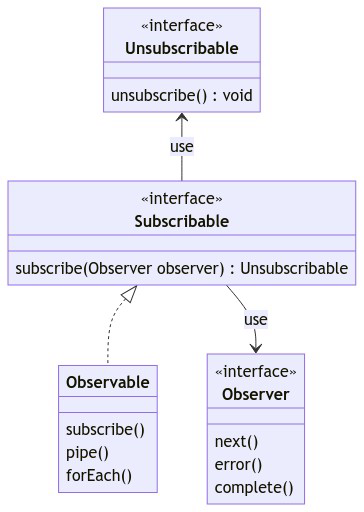
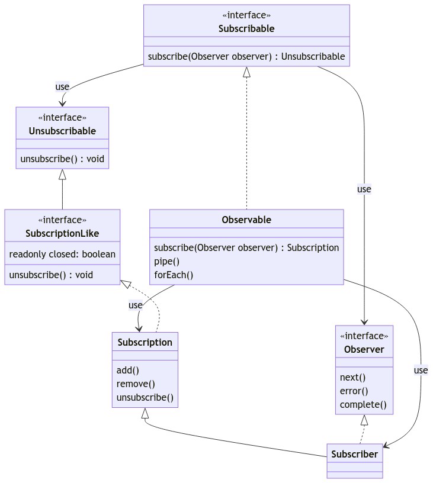

# Observer Example: RxJS library in Angular framework

## What is RxJS?

RxJS is a library for composing asynchronous and event-based programs by using observable sequences. It provides one core type, the Observable, satellite types (Observer, Schedulers, Subjects) and operators inspired by Array methods (map, filter, reduce, every, etc) to allow handling asynchronous events as collections.

ReactiveX combines the Observer pattern with the Iterator pattern and functional programming with collections to fill the need for an ideal way of managing sequences of events.

The essential concepts in RxJS which solve async event management are:

  - Observable:
  - Observer:
  - Subscription:
  - Operator
  - Subject
  - Schedulers

> https://rxjs.dev/guide/overview

In this example we are going to focus on the `Observable`, `Observer` and `Subscription` concepts.

So, let's get started.

- [Observer Example: RxJS library in Angular framework](#observer-example-rxjs-library-in-angular-framework)
  - [What is RxJS?](#what-is-rxjs)
  - [Observable](#observable)
- [First example](#first-example)
  - [Actual Source Code](#actual-source-code)
    - [Observable. 1](#observable-1)
    - [Subscribable. 1](#subscribable-1)
  - [Observer](#observer)
    - [Observer. 1](#observer-1)
    - [Unsubscribable. 1](#unsubscribable-1)
    - [Observable. 2](#observable-2)
    - [Subscriber. 1](#subscriber-1)
  - [Subscription](#subscription)
    - [Subscription. 1](#subscription-1)
    - [SubscriptionLike. 1](#subscriptionlike-1)


## Observable

Observables are lazy Push collections of multiple values. They fill the missing spot in the following table

The following is an Observable that pushes the values 1, 2, 3 immediately (synchronously) when subscribed, and the value 4 after one second has passed since the subscribe call, then completes:
# First example
```javascript
import { Observable } from 'rxjs';

const observable = new Observable((subscriber) => {
  subscriber.next(1);
  subscriber.next(2);
  subscriber.next(3);
  setTimeout(() => {
    subscriber.next(4);
    subscriber.complete();
  }, 1000);
});
```
To invoke the Observable and see these values, we need to subscribe to it:

```javascript
console.log('just before subscribe');
observable.subscribe({
  next(x) {
    console.log('got value ' + x);
  },
  error(err) {
    console.error('something wrong occurred: ' + err);
  },
  complete() {
    console.log('done');
  },
});
console.log('just after subscribe');
```

Output
```console
just before subscribe
got value 1
got value 2
got value 3
just after subscribe
got value 4
done
```

Let's go deeper into the `Observable` code source. This is the actual `Observable` class source code:

## Actual Source Code

### Observable. 1
```javascript
export class Observable<T> implements Subscribable<T> {

  source: Observable<any> | undefined;

  constructor(subscribe?: (this: Observable<T>, subscriber: Subscriber<T>) => TeardownLogic) {
    if (subscribe) {
      this._subscribe = subscribe;
    }
  }
  /** @internal */
  protected _subscribe(subscriber: Subscriber<any>): TeardownLogic {
    return this.source?.subscribe(subscriber);
  }
  /**
   * more code
   **/
}
```

As you can see, the `Observable` class implements the `Subscribable` interface. The `Subscribable` interface is defined as follows:

### Subscribable. 1

```javascript
/** OBSERVABLE INTERFACES */

export interface Subscribable<T> {
  subscribe(observer: Partial<Observer<T>>): Unsubscribable;
}
```

The `Subscribable` interface defines the `subscribe()` method. The subscribe method takes an `Observer` object as a parameter and returns an `Unsubscribable` object. The Observer interface is defined as follows:

## Observer
What is an Observer? An Observer is a consumer of values delivered by an Observable. Observers are simply a set of callbacks, one for each type of notification delivered by the Observable: next, error, and complete. The following is an example of a typical Observer object:
> https://rxjs.dev/guide/observer

### Observer. 1

```javascript
export interface Observer<T> {
  next: (value: T) => void;
  error: (err: any) => void;
  complete: () => void;
}
```

And this is the `Unsubscribable` interface:

### Unsubscribable. 1

```javascript
/* SUBSCRIPTION INTERFACES */
export interface Unsubscribable {
  unsubscribe(): void;
}
```

If we look at the diagram class with the info that we have at this moment, this is how it looks like:


### Observable. 2
Now lets go back to our `Observable` code source:

```javascript
 constructor(subscribe?: (this: Observable<T>, subscriber: Subscriber<T>) => TeardownLogic) {
    if (subscribe) {
      this._subscribe = subscribe;
    }
  }
```

The `Observable` constructor takes a `subscribe` *function* as a parameter. The `subscribe` function takes a `Subscriber` object as a parameter and returns a `TeardownLogic` type. The `Subscriber` interface is defined as follows:

### Subscriber. 1


```javascript
export class Subscriber<T> extends Subscription implements Observer<T> {
  /**
   * @deprecated Internal implementation detail, do not use directly. Will be made internal in v8.
   * There is no reason to directly create an instance of Subscriber. This type is exported for typings reasons.
   */
  constructor(destination?: Subscriber<any> | Observer<any>) {
    super();
    if (destination) {
      this.destination = destination;
      // Automatically chain subscriptions together here.
      // if destination is a Subscription, then it is a Subscriber.
      if (isSubscription(destination)) {
        destination.add(this);
      }
    } else {
      this.destination = EMPTY_OBSERVER;
    }
  }  

  /*
  * more code
  */
}
```
> Note: we know that there is no reason for us to create an instance of `Subscriber` directly, but we are doing it for learning purposes.


What a surpresive! The `Subscriber` class extends the `Subscription` class and implements the `Observer` interface. The `Subscription` class is defined as follows:

## Subscription

What is a Subscription? A Subscription is an object that represents a disposable resource, usually the execution of an Observable. A Subscription has one important method, unsubscribe, that takes no argument and just disposes the resource held by the subscription. In previous versions of RxJS, Subscription was called "Disposable".

### Subscription. 1


```javascript
export class Subscription implements SubscriptionLike {
  /**
   * A flag to indicate whether this Subscription has already been unsubscribed.
   */
  public closed = false;
  private _parentage: Subscription[] | Subscription | null = null;
  private _finalizers: Exclude<TeardownLogic, void>[] | null = null;

  /**
   * more code
   */
}
```

and the `SubscriptionLike` interface is defined as follows:

### SubscriptionLike. 1

```javascript
export interface SubscriptionLike extends Unsubscribable {
  unsubscribe(): void;
  readonly closed: boolean;
}
```
Wow! The SubscriptionLike interface extends the `Unsubscribable` interface. Our class diagram looks like this:



Now we understand better the relations between the `Observable`, `Subscribable`, `Observer`, `Unsubscribable`, `SubscriptionLike` and `Subscription` classes. Let's go back to our [First Example](#first-example) example.

```javascript
import { interval } from 'rxjs';

const observable1 = interval(400);
const observable2 = interval(300);

let observer1 = x => console.log('first: ' + x);
let observer2 = x => console.log('second: ' + x);

const subscription = observable1.subscribe(observer1);
const childSubscription = observable2.subscribe(observer2);

subscription.add(childSubscription);

setTimeout(() => {
  // Unsubscribes BOTH subscription and childSubscription
  subscription.unsubscribe();
}, 1000);
```
The output will be this:

```console
second: 0
first: 0
second: 1
first: 1
second: 2
```
If we do not unsubscribe, this would be the output:

```console
second: 0
first: 0
second: 1
first: 1
second: 2
first: 2
second: 3
second: 4
first: 3
second: 5
first: 4
second: 6
first: 5
.
.
.
```