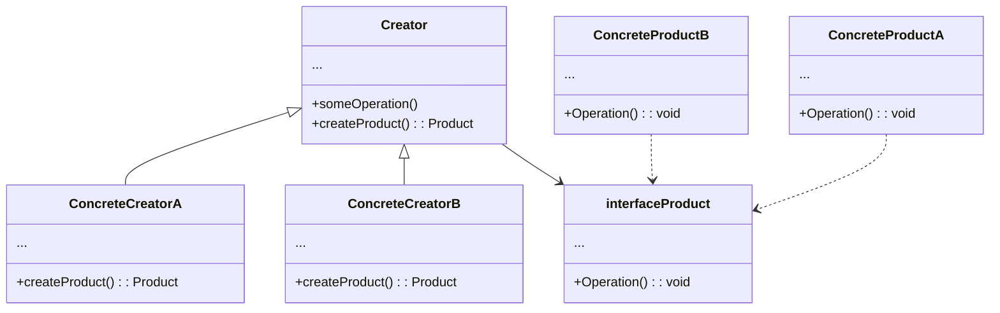

# Factory Method
---
Also known as Virtual Constructor, The *Factory Method* pattern is a [creational design pattern](https://www.javatpoint.com/creational-design-patterns) used to create objects without specifying the concrete class of object to be created. Instead of instantiating objects directly with the new operator, a method (the *"Factory Method"*) is defined in an interface or base class that subclasses must implement. Each subclass can provide its own implementation of the *Factory Method* to create concrete objects.

The *Factory Method* is used when you have a class hierarchy and want to delegate the responsibility of object creation to subclasses. This promotes the "Open/Closed" principle, which states that classes should be open for extension but closed for modification. In other words, you can add new concrete classes (extensions) without having to modify the code that uses the *Factory Method*.

## Structure
---



1. The Product declares the interface, which is common to all objects that can be produced by the creator and its subclasses.

2. Concrete Products are different implementations of the product interface.

3. Concrete Creators override the base *factory method* so it returns a different type of product.
Note that the *factory method* doesn’t have to create new instances all the time. It can also return existing objects from a cache, an object pool, or another source.

 4. The Creator class declares the *factory method* that returns new product objects. It’s important that the return type of this method matches the product interface.
You can declare the *factory method* as abstract to force all subclasses to implement their own versions of the method. As an alternative, the base *factory method* can return some default product type.

>   Note, despite its name, product creation is not the primary responsibility of the creator. Usually, the creator class already has some core business logic related to products. The *factory method* helps to decouple this logic from the concrete product classes. Here is an analogy: a large software development company can have a training department for programmers. However, the primary function of the company as a whole is still writing code, not producing programmers.

If you want to learn more about this software design pattern visit: [*Factory Method*](https://refactoring.guru/design-patterns/factory-method)

## Real application example
---

[](https://postimg.cc/mtMQ4Tp8)

TensorFlow is an end-to-end open source platform for machine learning. It has a comprehensive, flexible ecosystem of tools, libraries, and community resources that lets researchers push the state-of-the-art in ML and developers easily build and deploy ML-powered applications.

TensorFlow was originally developed by researchers and engineers working within the Machine Intelligence team at Google Brain to conduct research in machine learning and neural networks. However, the framework is versatile enough to be used in other areas as well.

TensorFlow provides stable Python and C++ APIs, as well as a non-guaranteed backward compatible API for other languages.

### How is  *Factory Method* implemented in TensorFlow?

---

Regarding the implementation of the design pattern in TensorFlow, you can observe in the code block `device_factory.h` that the primary function of this code block is to provide infrastructure for registering, creating, and managing different types of devices (such as CPU and GPU) that can be used in the context of machine learning with TensorFlow.

1. `DeviceFactory` is a base class that defines the interface for device factories. Device factories are responsible for creating instances of specific devices (e.g., CPU or GPU).

2. The code provides static methods for registering device factories. This allows different device implementations to be registered in the system and used as needed.

3. `Register` allows concrete classes (device factories) to register and create device instances without knowing the specific implementation details. Parameters include the device type, device factory, priority, and whether it's a pluggable device.

4. `GetFactory` is used to obtain a device factory for a specific device type.

5. `AddCpuDevices` and `AddDevices` are used to add devices to the system. `AddCpuDevices` adds CPU devices, and `AddDevices` adds all suitable devices, considering the specific device type properties in the options.

6. `ListAllPhysicalDevices` and `ListPluggablePhysicalDevices` generate lists of available physical and pluggable devices, respectively.

7. `GetAnyDeviceDetails` retrieves details of a specific device from all available device factories.

8. `ListPhysicalDevices` and `GetDeviceDetails` are functions that should be implemented in concrete device factories to list available physical devices and get specific device details, respectively.

9. `CreateDevices` is an abstract function that must be implemented in concrete device factories to create device instances.

10. `DevicePriority` returns the priority of a device type, which can influence the device choice when multiple options are available.

11. `IsPluggableDevice` checks if a device type is a pluggable or first-party device.

If you want to learn more about this proyect visit: [TensorFlow](https://github.com/tensorflow/tensorflow.git)

>#### Code in C++
```C++

#ifndef TENSORFLOW_CORE_FRAMEWORK_DEVICE_FACTORY_H_
#define TENSORFLOW_CORE_FRAMEWORK_DEVICE_FACTORY_H_

#include <string>
#include <vector>
#include "absl/base/attributes.h"
#include "tensorflow/core/platform/status.h"
#include "tensorflow/core/platform/types.h"

namespace tensorflow {

class Device;
struct SessionOptions;

class DeviceFactory {
public:
  virtual ~DeviceFactory() {}

  // Registers a device factory for a specific device type.
  static void Register(const std::string& device_type,
                      std::unique_ptr<DeviceFactory> factory, int priority,
                      bool is_pluggable_device);

  // Gets a registered device factory for a device type.
  static DeviceFactory* GetFactory(const std.string& device_type);

  // Appends CPU devices to the devices list.
  static Status AddCpuDevices(const SessionOptions& options,
                              const std::string& name_prefix,
                              std::vector<std::unique_ptr<Device>>* devices);

  // Appends devices to the list, respecting device-specific properties
  // and session options.
  static Status AddDevices(const SessionOptions& options,
                          const std::string& name_prefix,
                          std::vector<std::unique_ptr<Device>>* devices);

  // Creates a new device of a specific type.
  static std::unique_ptr<Device> NewDevice(const string& type,
                                          const SessionOptions& options,
                                          const string& name_prefix);

  // Lists all available physical devices.
  static Status ListAllPhysicalDevices(std::vector<string>* devices);

  // Lists all available pluggable physical devices.
  static Status ListPluggablePhysicalDevices(std::vector<string>* devices);

  // Gets details for a specific device among all available devices.
  static Status GetAnyDeviceDetails(
      int device_index, std::unordered_map<string, string>* details);

  // Interface to list physical devices for a device factory.
  virtual Status ListPhysicalDevices(std::vector<string>* devices) = 0;

  // Gets details for a specific device for a device factory.
  virtual Status GetDeviceDetails(int device_index,
                                  std::unordered_map<string, string>* details) {
    return OkStatus();
  }

  // Creates devices based on session options and a specific name.
  virtual Status CreateDevices(
      const SessionOptions& options, const std::string& name_prefix,
      std::vector<std::unique_ptr<Device>>* devices) = 0;

  // Gets the priority of a device type.
  static int32 DevicePriority(const std::string& device_type);

  // Checks if a device type is pluggable.
  static bool IsPluggableDevice(const std::string& device_type);
};

namespace dfactory {

template <class Factory>
class Registrar {
public:
  // Registers a device factory with a priority for a device type.
  explicit Registrar(const std::string& device_type, int priority = 50) {
    DeviceFactory::Register(device_type, std::make_unique<Factory>(), priority,
                            /*is_pluggable_device*/ false);
  }
};

}  // namespace dfactory

#define REGISTER_LOCAL_DEVICE_FACTORY(device_type, device_factory, ...) \
  INTERNAL_REGISTER_LOCAL_DEVICE_FACTORY(device_type, device_factory,   \
                                        __COUNTER__, ##__VA_ARGS__)

#define INTERNAL_REGISTER_LOCAL_DEVICE_FACTORY(device_type, device_factory, \
                                              ctr, ...)                    \
  static ::tensorflow::dfactory::Registrar<device_factory>                  \
  INTERNAL_REGISTER_LOCAL_DEVICE_FACTORY_NAME(ctr)(device_type, ##__VA_ARGS__)

#define INTERNAL_REGISTER_LOCAL_DEVICE_FACTORY_NAME(ctr) ___##ctr##__object_

}  // namespace tensorflow

#endif  // TENSORFLOW_CORE_FRAMEWORK_DEVICE_FACTORY_H_

```
## Relationship with SOLID and OCP
---
The Factory Method pattern primarily adheres to the SOLID principle known as the Single Responsibility Principle (SRP), although it may relate to other principles depending on its specific implementation.

Single Responsibility Principle (SRP): The Factory Method promotes compliance with the SRP by separating the responsibility of object creation into a specific class (the Factory Method) rather than having this responsibility distributed throughout the client code. Each subclass implementing the Factory Method has the sole responsibility of creating instances of a specific type of object. This facilitates code management and maintenance by focusing each class on a single task.

While the Factory Method is not directly related to other SOLID principles, its use can indirectly contribute to other principles such as the Open/Closed Principle (OCP) and the Liskov Substitution Principle (LSP) as it enables the extension and replacement of classes without modifying existing code.