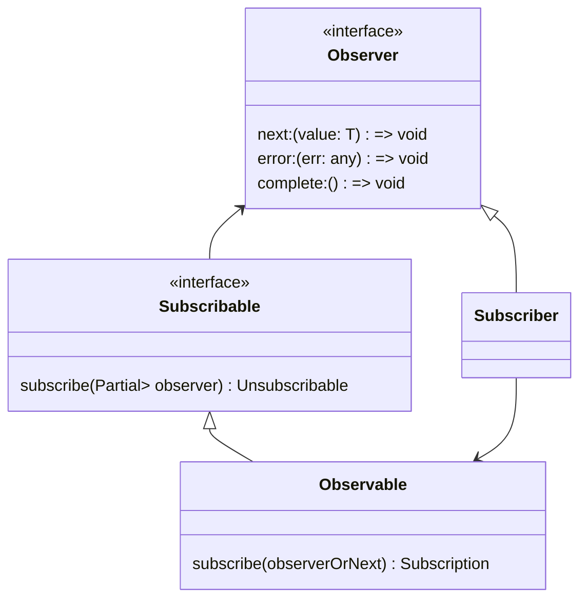

# Observer Example: RxJS library in Angular framework


> ReactiveX combines the Observer pattern with the Iterator pattern and functional programming with collections to fill the need for an ideal way of managing sequences of events.


## Subject interface: `Subscribable`
> Source: **[/rxjs/src/internal/types.ts](https://github.com/ReactiveX/rxjs/blob/master/packages/rxjs/src/internal/types.ts)**
>
```javascript
/* OBSERVABLE INTERFACES */

export interface Subscribable<T> {
  subscribe(observer: Partial<Observer<T>>): Unsubscribable;
}

```

## Concrete subject: ``Observable`` 
> Source: [rxjs/src/internal/Observable.ts](https://github.com/ReactiveX/rxjs/blob/master/packages/rxjs/src/internal/Observable.ts)
>
> 
```javascript
export class Observable<T> implements Subscribable<T> {
  /**
   * @param subscribe The function that is called when the Observable is
   * initially subscribed to. This function is given a Subscriber, to which new values
   * can be `next`ed, or an `error` method can be called to raise an error, or
   * `complete` can be called to notify of a successful completion.
   */
  constructor(subscribe?: (this: Observable<T>, subscriber: Subscriber<T>) => TeardownLogic) {
    if (subscribe) {
      this._subscribe = subscribe;
    }
  }
 ```

```javascript
 /*
  ... Other methods...
*/
```

 ```javascript
 subscribe(observerOrNext?: Partial<Observer<T>> | ((value: T) => void) | null): Subscription {
    const subscriber = observerOrNext instanceof Subscriber ? observerOrNext : new Subscriber(observerOrNext);
    subscriber.add(this._trySubscribe(subscriber));
    return subscriber;
  }
  /*
  .
  ... Other methods...
  .
  */
}
```

## Observer interface: `Observer`
```javascript
export interface Observer<T> {
  /**
   * A callback function that gets called by the producer during the subscription when
   * the producer "has" the `value`. It won't be called if `error` or `complete` callback
   * functions have been called, nor after the consumer has unsubscribed.
   *
   * For more info, please refer to {@link guide/glossary-and-semantics#next this guide}.
   */
  next: (value: T) => void;
  /**
   * A callback function that gets called by the producer if and when it encountered a
   * problem of any kind. The errored value will be provided through the `err` parameter.
   * This callback can't be called more than one time, it can't be called if the
   * `complete` callback function have been called previously, nor it can't be called if
   * the consumer has unsubscribed.
   *
   * For more info, please refer to {@link guide/glossary-and-semantics#error this guide}.
   */
  error: (err: any) => void;
  /**
   * A callback function that gets called by the producer if and when it has no more
   * values to provide (by calling `next` callback function). This means that no error
   * has happened. This callback can't be called more than one time, it can't be called
   * if the `error` callback function have been called previously, nor it can't be called
   * if the consumer has unsubscribed.
   *
   * For more info, please refer to {@link guide/glossary-and-semantics#complete this guide}.
   */
  complete: () => void;
}
```

## Concrete observer: `Subscriber`

```javascript
export class Subscriber<T> extends Subscription implements Observer<T> {
  /** @internal */
  protected isStopped: boolean = false;
  /** @internal */
  protected destination: Observer<T>;

  /** @internal */
  protected readonly _nextOverride: ((value: T) => void) | null = null;
  /** @internal */
  protected readonly _errorOverride: ((err: any) => void) | null = null;
  /** @internal */
  protected readonly _completeOverride: (() => void) | null = null;
  /** @internal */
  protected readonly _onFinalize: (() => void) | null = null;

  /**
   * @deprecated Do not create instances of `Subscriber` directly. Use {@link operate} instead.
   */
  constructor(destination?: Subscriber<T> | Partial<Observer<T>> | ((value: T) => void) | null);

  /**
   * @internal
   */
  constructor(destination: Subscriber<any> | Partial<Observer<any>> | ((value: any) => void) | null, overrides: 
  SubscriberOverrides<T>);

  /*
  .
  ... Other methods...
  .
  */
  /**
   * The {@link Observer} callback to receive notifications of type `next` from
   * the Observable, with a value. The Observable may call this method 0 or more
   * times.
   * @param value The `next` value.
   */
  next(value: T): void {
    if (this.isStopped) {
      handleStoppedNotification(nextNotification(value), this);
    } else {
      this._next(value!);
    }
  }

  /**
   * The {@link Observer} callback to receive notifications of type `error` from
   * the Observable, with an attached `Error`. Notifies the Observer that
   * the Observable has experienced an error condition.
   * @param err The `error` exception.
   */
  error(err?: any): void {
    if (this.isStopped) {
      handleStoppedNotification(errorNotification(err), this);
    } else {
      this.isStopped = true;
      this._error(err);
    }
  }

  /**
   * The {@link Observer} callback to receive a valueless notification of type
   * `complete` from the Observable. Notifies the Observer that the Observable
   * has finished sending push-based notifications.
   */
  complete(): void {
    if (this.isStopped) {
      handleStoppedNotification(COMPLETE_NOTIFICATION, this);
    } else {
      this.isStopped = true;
      this._complete();
    }
  }

  unsubscribe(): void {
    if (!this.closed) {
      this.isStopped = true;
      super.unsubscribe();
      this._onFinalize?.();
    }
  }


```

## Class Diagram of the exaple



